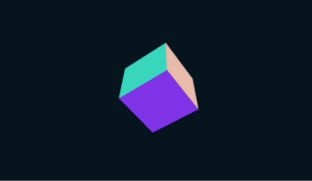

# learning-react-three-fiber.

Step by step examples on how to use [React-Three-Fiber (r3f)](https://github.com/react-spring/react-three-fiber).

## Work in process.

Please note these are small examples I'm still builing following React-Three-Fiber's examples.  
These are **not** the offical librarys examples.

## Why?

React-three-fiber official examples are good, but they are also huge.  
Instead of building one big thing, I've made smaller step by step code examples when learning React-Three-Fiber.  
It helped me :)

T1: [r3f + basic cube](https://codesandbox.io/s/t1-react-three-fiber-xmfqh).  

T2: [r3f + basic Cannon](https://codesandbox.io/s/t2-react-three-fiber-cannon-g2q0w).  

T3: [r3f + basic useGesture](https://codesandbox.io/s/t3-react-three-fiber-usegesture-grewc).

T4: [r3f + basic particles](https://codesandbox.io/s/t4-react-three-fiber-particles-3lzob)  

T5: [r3f + postprocessing](https://codesandbox.io/s/t5-react-three-fiber-post-processing-khe7l).  
T6: [r3f + custom postprocessing](https://codesandbox.io/s/t6-react-three-fiber-custom-post-processing-x3tz7).  

T7: [r3f + glb](https://codesandbox.io/s/t7-react-three-fiber-glb-edm80).  

T8: [r3f + instancedMesh](https://codesandbox.io/s/t8-react-three-fiber-instancedmesh-rpytg).  

T9: [r3f + shadermaterial](https://codesandbox.io/s/t9-react-three-fiber-shadermaterial-gw4dm).  

T10: [r3f + dom](https://codesandbox.io/s/t10-react-three-fiber-dom-ygu51).
