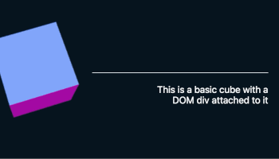

# learning-react-three-fiber.

Step by step examples on how to use [React-Three-Fiber (r3f)](https://github.com/react-spring/react-three-fiber).

## Work in process.

Please note these are small examples I'm still builing following React-Three-Fiber's examples.  
These are **not** the offical librarys examples.

## Why?

React-three-fiber official examples are good, but they are also huge.  
Instead of building one big thing, I've made smaller step by step code examples when learning React-Three-Fiber.  
It helped me :)

#### r3f + basic cube
.    
👾 [basic cube → codesandbox](https://codesandbox.io/s/t1-react-three-fiber-xmfqh).   

#### r3f + basic Cannon
.  
👾 [ basic Cannon → codesandbox](https://codesandbox.io/s/t2-react-three-fiber-cannon-g2q0w).  

#### r3f + basic useGesture
.  
👾 [basic useGesture → codesandbox](https://codesandbox.io/s/t3-react-three-fiber-usegesture-grewc).

#### r3f + basic particles
.  
👾 [basic particles → codesandbox](https://codesandbox.io/s/t4-react-three-fiber-particles-3lzob) 

#### r3f + basic postprocessing
.  
👾 [postprocessing → codesandbox](https://codesandbox.io/s/t5-react-three-fiber-post-processing-khe7l).  

#### r3f + custom postprocessing
👾 [custom postprocessing → codesandbox](https://codesandbox.io/s/t6-react-three-fiber-custom-post-processing-x3tz7). 

#### r3f + basic glb
.  
👾 [glb → codesandbox](https://codesandbox.io/s/t7-react-three-fiber-glb-edm80). 

#### r3f + basic instancedMesh
.  
👾 [instancedMesh → codesandbox](https://codesandbox.io/s/t8-react-three-fiber-instancedmesh-rpytg). 

#### r3f + basic shaderMaterial
.  
👾 [shadermaterial → codesandbox](https://codesandbox.io/s/t9-react-three-fiber-shadermaterial-gw4dm). 

#### r3f + basic dom
.  
👾 [dom → codesandbox](https://codesandbox.io/s/t10-react-three-fiber-dom-ygu51).
